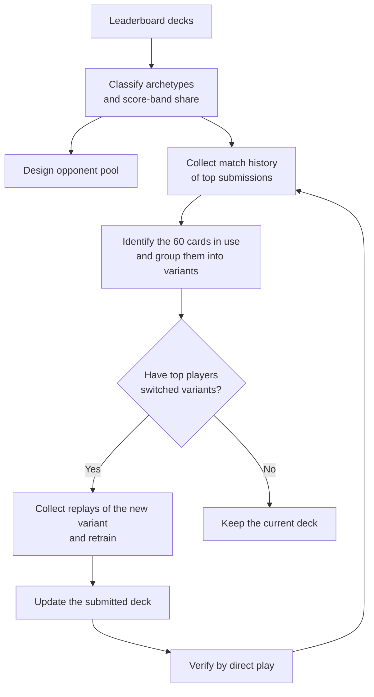
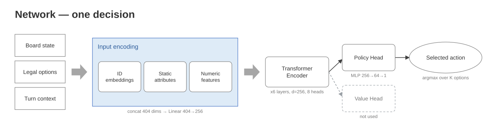
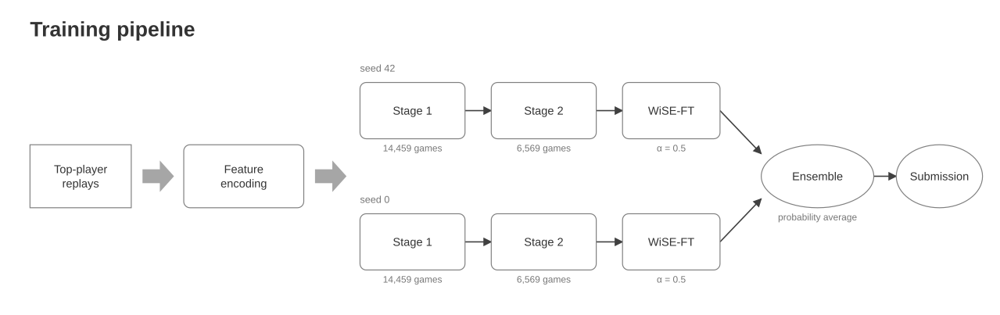

# PTCG AI Battle Challenge — Alakazam Agent

ポケモンカードゲームの対戦 AI コンペティション
[The Pokémon Company - PTCG AI Battle Challenge](https://www.kaggle.com/competitions/pokemon-tcg-ai-battle)
に向けて開発したエージェントの、設計・実験・評価の記録。
学習と評価のコードも収録している（→ [§7](#7-コードと再現手順)）。

**やったこと**

- 上位人間プレイヤーのリプレイから、模倣学習で方策を訓練した
- デッキ構築そのものもラダーのデータ解析で選定し、メタの変化を検知して更新した
- 採用の判断はすべて、相手ごと400試合・95%信頼区間つきの直接対戦で決めた
- 最大シェア相手（Grimmsnarl）への勝率を 0.414 → 0.570 まで改善した

**エージェントの構成**

| 項目 | 内容 |
| :--- | :--- |
| 使用デッキ | Alakazam（ラダー上位者の構築を解析して採用。コンペ中に1度更新） |
| 学習手法 | 模倣学習（Behavior Cloning）の2段階学習 → WiSE-FT → シードアンサンブル |
| モデル | 候補スコアリング型 Transformer（d=256 / 6層 / 8 head / 5.03M パラメータ） |
| 教師データ | 上位プレイヤーのリプレイ 約21,000試合・約186万意思決定 |
| 評価 | 主要4アーキタイプと各400試合・先手後手交代・95%信頼区間 |

**目次**

1. [問題設定と設計目標](#1-問題設定と設計目標)
2. [デッキ選定 — データでデッキを選び、更新する](#2-デッキ選定--データでデッキを選び更新する)
3. [エージェント設計](#3-エージェント設計)
4. [評価方法](#4-評価方法)
5. [結果](#5-結果)
6. [検証してうまくいかなかったこと](#6-検証してうまくいかなかったこと)
7. [コードと再現手順](#7-コードと再現手順)
8. [データとライセンスについて](#8-データとライセンスについて)

---

## 1. 問題設定と設計目標

### 1.1 3つの難しさ

| # | 難しさ | 内容 |
| :-: | :--- | :--- |
| ① | 不完全情報 | 相手の手札・山札が見えない |
| ② | 選ぶ対象が局面ごとに入れ替わる | 手札のカード、ベンチのポケモン、山札から見えたカード…と、選択の種類も個数も毎回変わる |
| ③ | 相手のメタが週単位で変動する | 提出時点で最終的な相手の分布は分からない |

②が設計の中心を決めた。囲碁なら「19×19＝361ある交点のどこに石を置くか（またはパス）」、
将棋なら「どの駒をどこへ動かすか」というように、起こりうる行動をあらかじめ全部並べた
固定の一覧を作れる。実際 AlphaGo Zero の方策ネットワークは 362通り（361交点＋パス）を
出力する固定サイズの層を持ち、ルール上打てない手は確率をゼロにして取り除いている。

ポケモンカードにはこの一覧が作れない。さらに手札の中身はターンごとに変わるので、
「手札から1枚選ぶ」という同じ形式の場面ですら、並んでいる候補は毎回別物になる。

### 1.2 設計目標

③から、目標を「特定の相手への最大勝率」ではなく
**どの相手にも大きな弱点を作らない、バランスの取れた勝率**と定義した。
相手デッキの分布はスコア帯によって大きく異なるため、特定の分布を仮定した最適化は
その仮定ごと外れるリスクがある。そこで主指標は、主要マッチアップの等重み平均勝率とした。

この目標から3つの方針が導かれる。

- **人間上位者の実演を学習の錨にする** — 教師の質はラダースコアで担保できる
- **変更は1点ずつ、同条件で A/B 比較する**
- **採用判断は直接対戦のみで行う** — 学習時の検証指標では決めない

---

## 2. デッキ選定 — データでデッキを選び、更新する

デッキリストを人手で設計する代わりに、ラダーのデータを解析して選定し、
メタの変化に合わせて更新するループを回した。解析の対象は2種類ある。

- **リーダーボード全チームの提出デッキ** — アーキタイプ（デッキの種類）の分布を把握する。
  ある時点のスナップショットとして全チーム分を分類した
- **上位提出の対戦リプレイ** — 打ち筋の教師データと、構築の細部を知る。
  こちらは上位プレイヤーのみを対象にしている



### 2.1 なぜ Alakazam か

- **教師データが最も厚い** — 調査時点で全体シェア2位のアーキタイプであり、
  上位プレイヤーのリプレイを大量に確保できる
- **デッキ自体の強さが実証されている** — 上位スコア帯でもシェアを維持しており、
  このデッキで高スコアに到達した実例が多い。大会環境のデッキ分布を集計している
  外部サイト Limitless TCG（→ [関連リンク](#関連リンク)）でも上位に位置づけられており、
  人間の競技環境でも通用する構築であることを確認した

60枚のリストは発明せず、最上位プレイヤーの構築をそのまま採用した。

### 2.2 メタ変化の検知とデッキ更新

コンペ終盤、公開 API で直近の上位提出の対戦履歴を収集し、手元のリプレイと突き合わせて
相手のデッキを特定したところ、**スコア上位の Alakazam 使い9名が全員、スタジアム
Battle Cage を採用した構築へ移行済み**だった。それまで我々が使っていた構築
（Nighttime Mine 採用。以下「旧構築」）を使う上位者はゼロになっていた。

Battle Cage の流行は一義的には Dragapult 系への対策と読める。
ただし Grimmsnarl も同様に Munkidori を採用するデッキであるため、
副次的に Grimmsnarl 対策としても機能した可能性が高い。
下表の対 Grimmsnarl 勝率の大幅な改善は、この読みと整合する。

そこで上位9名の直近546試合を追加取得して教材に加え、その教材で学習し直したうえで、
提出デッキも Battle Cage を採用した構築（以下「新構築」）へ更新した。

効果は明確だった。最大シェアの Grimmsnarl への勝率は **0.463 → 0.570（+10.7pt）** に改善した
（更新の前後で条件を揃えるため、どちらもシードアンサンブル版で比較している）。
他の相手を含む全体成績は [§5](#5-結果) を参照。トレードオフはあるが、等重み平均では純益である。

> [!NOTE]
> 対戦相手も含め、ここに登場するエージェントはすべて自作である。
> 上位プレイヤーのリプレイから同じ手法でクローンを作り、評価用の相手として使っている。

### 2.3 4つの候補構築から、どれを採用するか

新構築の候補は、細部のカードが異なる4種類に割れていた（以下 型A〜型D と呼ぶ）。

ここで効いてくるのが、手元の教材の内訳である。この時点で学習に使える教材は、
旧構築の試合が約15,000試合と大半を占め、新構築の候補4種類は合計546試合しかない。
新構築として旧構築から遠い（＝カードが大きく違う）型を選んでしまうと、
手元にある大量の旧構築の試合が「自分のデッキとはかなり違うデッキの記録」になり、
学習の役に立ちにくくなる。

そこで採用基準を **手元の全教材から見ていちばん近い構築** と定めた。
候補の型を X、教材に含まれる構築を Y（旧構築・型A〜型Dのすべて）とすると、
X の「遠さ」は次で定義される。

$$\text{遠さ}(X) = \sum_{Y} \bigl(\text{X と Y のカード枚数差}\bigr) \times \bigl(\text{Y の試合数}\bigr)$$

X 自身の試合数ではなく、相手側 Y の試合数で重み付けして Y をすべて足し合わせる点が重要である。
たとえば型Aの遠さは、次の4行の合計になる。

| 相手側の構築 Y | 型A との枚数差 | Y の試合数 | 積 |
| :--- | ---: | ---: | ---: |
| 旧構築 | 8枚 | 15,154 | 121,232 |
| 型B | 4枚 | 57 | 228 |
| 型C | 2枚 | 69 | 138 |
| 型D | 8枚 | 136 | 1,088 |
| **合計 = 型A の遠さ** | | | **122,686** |

同じ計算を4候補すべてに対して行い、値が最小の型Aを採用した。

| 候補 | その型の教材 | 旧構築との枚数差 | 遠さ（型Aを 1.00 とした相対値） |
| :--- | ---: | ---: | ---: |
| **型A（採用）** | 284試合 | 8枚 | **1.00** |
| 型B | 57試合 | 8枚 | 1.01 |
| 型C | 69試合 | 10枚 | 1.25 |
| 型D | 136試合 | 16枚 | 2.00 |

型Aと型Bは旧構築との枚数差が同じ（8枚）だが、型Aは他の候補ともカードが近い（2〜8枚差）
のに対し、型Bはより離れている（4〜10枚差）。その差が合計に効いて型Aが最小となった。

採用した型（＝新構築）と旧構築の違いは次の8枚である（残る18種類は採用枚数が完全に一致している）。

| カード | 旧構築 | 新構築 | 役割 |
| :--- | ---: | ---: | :--- |
| Battle Cage | 0 | **3** | 新規採用のスタジアム。Munkidori を採用する相手への対策 |
| Nighttime Mine | 2 | 0 | 旧構築のスタジアム枠 |
| Rare Candy | 3 | 4 | 進化の加速を厚く |
| Boss's Orders | 3 | 2 | 上記の枠を捻出 |
| Xerosic's Machinations | 3 | 2 | 同上 |

スタジアムの入れ替えが変更の中心で、残りはその枠を作るための調整にあたる。

---

## 3. エージェント設計

### 3.1 ネットワーク — 候補スコアリング型 Transformer



この節では、1回の意思決定でネットワークが何を受け取り何を返すかだけを扱う（学習の手順は §3.2）。

#### 出力の作り方から決まった構造

一般的な設計では、出力層のユニット数を「起こりうる行動の総数」に固定しておき、
そのうちルール上できない手をマスクして消す。ポケモンカードでは §1 の②のとおり
行動の総数を決められないので、この形が取れない。

そこで本モデルは、候補手を入力トークンとして列に並べ、その1トークンにつきスコアを
1つ出す構造にした。出力の個数は入力に並べた候補の数 K で決まり、対局中は長さ K の
ベクトルがそのまま返る。固定サイズの出力層を持たないので、行動の総数を決めておく必要がない。
また、エンジンが提示しなかった手は列に存在せず、スコアが付く先そのものがないため、
選ばれることが構造的に起こりえない。

#### 入力

入力は2種類のトークンを並べた1本の列である。

- **盤面トークン** — いま存在するカード1枚が1トークン（自分と相手のバトル場・ベンチ・
  手札・捨札の要約・スタジアム）。列の先頭には、ターン数やサイドの残り枚数といった
  全体の状況をまとめたトークンを1つ置く
- **候補手トークン** — エンジンが「この局面ではこれらから選べ」と提示してきた選択肢の
  1つが1トークン。K 個並ぶ。K は決定ごとに変わる（手札から1枚トラッシュする場面なら
  手札の枚数、ベンチのポケモンを選ぶ場面ならベンチの数）

系列は `[全体トークン] + [盤面トークン …] + [候補手トークン × K]` となる。

#### 各トークンをどう数値にするか（カードidを例に）

エンジンから来るのはカード名ではなく整数のID（例: Alakazam = 743）である。
この数字は通し番号にすぎないため、そのまま数値として入力すると
「742 のカードに近い」といった存在しない関係を読み取ってしまう。
そこで ID は、カードごとに割り当てたベクトルに置き換える。

具体的には 1,268行 × 64列の行列を用意する。行数の内訳は、エンジンが提供する
全カード 1,267 種類が1種類につき1行、これに「カードがない」ことを表す行が1つ加わって
1,268 行である。Alakazam の入力は、この行列の 743 行目にある 64個の数値になる。
ワザIDも同じ仕組みで、別の行列（1,557行 × 32列）から取り出す。

この行列は、我々が用意した辞書ではなくモデルの重みの一部である。
提出する重みファイルの中に `emb_card.weight`（1,268 × 64）としてそのまま入っており、
中身は乱数で初期化される。つまり「Alakazam とはこういうカードだ」という意味づけを
人間が与えたことは一度もなく、予測を当てるのに都合が良い数値へ落ち着いたものが入っている。

図の Input encoding にある3つの箱は、それぞれ次の処理を指す。

| 箱 | 中身 | 次元 |
| :--- | :--- | ---: |
| ID embeddings | 上記の行列から、そのカード／ワザに対応する行を取り出す | 64 + 32 ほか |
| Static attributes | カードやワザの固定情報を人手で数値化した表を引く（HP・カード種別・エネルギータイプ・弱点・抵抗・にげるコスト、ワザのダメージ量や必要エネルギー数など） | 58 / 14 |
| Numeric features | その局面でしか決まらない値（残りHP、ついているエネルギーの数、状態異常、手札やサイドの残り枚数、ターン数など） | 44 |

3つを連結すると1トークンが 404次元になり、線形変換で 256次元に揃えてから
Transformer に入れる。

#### 符号化と出力

Transformer Encoder 6層（Pre-LN / 8 head / FFN 1024）が系列全体を読む。
自己注意によって、各トークンは同じ列にある他のトークンを参照した表現として符号化される。
候補手トークンも盤面トークンを参照するため、その出力ベクトルは「その手」単体ではなく
「いまの盤面でその手を選ぶこと」を表す。

最後に候補手トークンだけを Policy Head でスカラーに変換し、その K 個の上で softmax して、
最も確率の高い手を選ぶ。勝敗を予測する Value Head も同じバックボーンに付いているが、
最終モデルでは使っていない。

### 3.2 学習と合成 — 2段階学習・WiSE-FT・シードアンサンブル



#### 2段階学習

| 段階 | 教材 | 規模 |
| :--- | :--- | ---: |
| 段1 | 旧世代を含む広い教材で基礎を学習 | 14,459試合 / 1,312,746意思決定 |
| 段2 | 最新の上位教師に絞って追加学習 | 6,569試合 / 546,692意思決定 |

リプレイを特徴量に変換し（図の Feature encoding）、教師が実際に選んだ手を当てる
クロスエントロピーで学習する。教材には、細部が数枚異なる構築の試合も混ぜている。
使う構築を1種類に絞るべきかを A/B で検証したところ、複数の構築を混ぜたほうが
有意に強く、これを複数回再現した。Value Head は損失に一切加えていない（λ_v = 0）。
補助的に学習させても直接対戦の成績が変わらなかったためである。

#### WiSE-FT

段2まで学習したモデルは、等重み平均が 0.464 にとどまった。
最新の教師に寄せた分、幅広い相手への対応力が落ちたものと解釈している。

そこで [WiSE-FT](https://arxiv.org/pdf/2109.01903)（Wortsman et al., CVPR 2022）を適用した。
段1と段2の重みを、次のように線形に混ぜるだけの手法である。

$$\theta = (1-\alpha)\,\theta_{\text{段1}} + \alpha\,\theta_{\text{段2}}$$

元論文では、微調整で失われる頑健性を、微調整の利得を保ったまま回復できることが
示されている。本プロジェクトでも α=0.5（1:1 の混合）で同じ効果が再現し、
等重み平均は 0.464 → 0.500 に回復した。

#### シードアンサンブル

乱数シードだけを変えて同じ手順で作った2本の出力（確率）を平均し、提出モデルとした
（等重み平均 0.522）。シード違いの重みを直接平均すると性能が壊れるが、
出力の平均は安定して効く。

学習は RTX 5090 で段1 約2.7時間 + 段2 約1.1時間。評価は CPU のみで行う。

---

## 4. 評価方法

モデルの優劣は、すべて次のプロトコルによる直接対戦で決めた。

| 項目 | 内容 |
| :--- | :--- |
| 対戦相手プール | 主要アーキタイプ4種（Grimmsnarl / Alakazam アンカー / Lopunny / Rocket）。アンカーは初期世代の自作モデル（旧構築）で、世代をまたいで数字を比べられるよう、評価のたびに差し替えず固定している |
| 測定 | 相手ごと400試合・先手後手を交代・95%信頼区間を常に併記 |
| 集計 | 主指標は4相手への等重み平均勝率。拮抗する場合は、どの相手への差が効いているかを個別に確認する |
| ラダーとの突合 | 絶対値では判断せず、同じ日に提出した2つのモデルを、提出からの経過時間を揃えて相対比較する |

---

## 5. 結果

主要4アーキタイプに対する勝率（各400試合）。太字が最終提出モデル。

| デッキ | WiSE-FT | アンサンブル | Grimmsnarl | Alakazam アンカー | Lopunny | Rocket | 等重み平均 |
| :--- | :-: | :-: | ---: | ---: | ---: | ---: | ---: |
| 旧構築 | – | – | — | — | — | — | — |
| 旧構築 | ✓ | – | 0.410 | 0.618 | 0.544 | 0.405 | 0.494 |
| 旧構築 | ✓ | ✓ | 0.463 | 0.654 | 0.555 | 0.385 | 0.514 |
| 新構築 | – | – | 0.568 | 0.518 | 0.497 | 0.273 | 0.464 |
| 新構築 | ✓ | – | 0.583 | 0.579 | 0.532 | 0.305 | 0.500 |
| **新構築** | **✓** | **✓** | **0.570** | **0.588** | **0.580** | **0.350** | **0.522** |

> [!NOTE]
> 全行とも同一のネットワーク（d256 / 6層 / 8 head）。
> 旧構築で WiSE-FT もアンサンブルも使わない条件は測っていない（表の「—」）。

- **積み上げの効果** は、それぞれのデッキの中を縦に読むと分かる。新構築は WiSE-FT で
  0.464 → 0.500（+3.6pt）、さらにアンサンブルで 0.522（+2.2pt）。
  旧構築でもアンサンブルは 0.494 → 0.514（+2.0pt）と同じ向きに効いている
- **最大の一段はデッキ更新** だった。最大シェアの Grimmsnarl への勝率が +10.7pt 動いている
  （単体モデルでは 0.583 に到達）。学習の手法自体は変えておらず、
  デッキと教材を最新のメタへ追随させただけでこの差が出た
- **トレードオフ** として旧構築のアンカーには負け越し方向に動いたが、
  等重み平均では純益（0.514 → 0.522）であることを確認して採用した

---

## 6. 検証してうまくいかなかったこと

有望に見えて実際に試し、採用に至らなかった施策が2つある。いずれも §4 のプロトコルで判定した。

#### 先読み探索

候補手ごとに数手先までシミュレーションし、局面の勝ちやすさを数値化する評価関数で
1手を選ぶ方式を試した。実際の対戦で勝率は動かず、探索は導入していない。

#### 強化学習（PPO）

自己対戦で模倣の天井を超えることを狙った。人間リプレイの模倣損失を毎回の更新に混ぜて
打ち筋の錨とし、練習相手を5系統に増やし、採用判断は相手プール全体の勝率で行う設計にした。
別デッキ（Dragapult）ではプール勝率が大きく改善し、練習相手に一度も入れていない
デッキへの勝率まで 0.005 → 0.255 に伸びた。

ただし、この方式で作った提出はラダーで期待した順位に届かず、Alakazam では
模倣学習ベースのモデルが上回ったため、最終提出には採用していない。

---

## 7. コードと再現手順

### 7.1 構成

```
.
├── Imitation_Learning/src/
│   ├── learn/                    # 学習
│   │   ├── featurize.py          #   トークン表現の定義（§3.1。学習と推論で共有）
│   │   ├── dataset.py / model.py #   データローダと候補スコアリング型 Transformer
│   │   ├── train.py              #   学習ループ（段1・段2 とも同一スクリプト）
│   │   ├── make_wise_ft.py       #   WiSE-FT（重みの線形補間）
│   │   └── export_weights.py     #   チェックポイント → 提出用 npz
│   ├── submit/
│   │   ├── infer_numpy.py        #   torch 非依存の推論器（提出と同一のコード）
│   │   └── make_submission.py    #   提出 tarball の作成
│   └── eval/                     # 評価
│       ├── arena.py              #   直接対戦の実行（並列・先手後手交代・CI 集計）
│       ├── ensemble_agent.py     #   シードアンサンブル（出力平均）の推論
│       └── external_agent.py     #   公開 Notebook 形式のエージェントを相手にするアダプタ
├── figures/                      # README の図（生成スクリプトと編集用 pptx を同梱）
├── requirements.txt
└── LICENSE                       # MIT（本リポジトリのコードのみ。§8 参照）
```

再現手順は**教師データ（npz）がある状態から**始める。
リプレイの収集と特徴量への変換（§2 のループの前半）は、競技データの取得・加工に
直結するため、そのコードは本リポジトリに含めていない。方式は §2 と §3.1 に記載のとおり。

### 7.2 前提

1. コンペティションに参加登録し、ルールに同意していること
   （評価・提出に使うゲームエンジンの利用が、ルールで参加者に限定されているため）
2. コンペ配布のゲームエンジンを `engine/` に配置し、`PYTHONPATH` で指すこと
   （学習だけならエンジンは不要。評価③と提出後の動作確認に必要）
3. `pip install -r requirements.txt`
4. 教師データの npz（下記）

**教師データの定義。** npz は「リプレイから抽出した（盤面, 教師が選んだ手）のペアを
§3.1 のトークン表現に変換したもの」で、最終提出では次の2つを使った。

| ファイル | 中身 | 規模 |
| :--- | :--- | ---: |
| 段1.npz | 旧構築の上位教師のリプレイ | 14,459試合 / 1,312,746決定 |
| 段2.npz | コンペ終盤まで上位に残っていた旧構築の教師（6,029試合）＋ 新構築の教師（546試合） | 6,569試合 / 546,692決定 |

段2は「新構築のみ」ではない点に注意。新構築の教材は546試合と少ないため、
終盤時点でも上位にいた旧構築の教師を合わせて規模を確保している。

### 7.3 再現手順（リポジトリ直下から）

**① 学習（段1 → 段2）** — 最終提出は seed 42 と 0 の2回、これを実行する

```bash
cd Imitation_Learning/src/learn
python3 train.py --features <段1>.npz --out ../../runs/stage1 \
  --d-model 256 --n-layer 6 --n-head 8 --d-ff 1024 \
  --epochs 30 --batch-size 1024 --lr 3e-4 --dropout 0.1 \
  --seed 42 --val-frac 0.1 --value-weight 0 --best-metric acc_exact --device cuda
python3 train.py --features <段2>.npz --out ../../runs/stage2 \
  --init-ckpt ../../runs/stage1/best.pt \
  --d-model 256 --n-layer 6 --n-head 8 --d-ff 1024 \
  --epochs 30 --batch-size 1024 --lr 3e-4 --dropout 0.1 \
  --seed 42 --val-frac 0.1 --value-weight 0 --best-metric acc_exact --device cuda
```

**② WiSE-FT** — 段1 best と段2 best の重みを 1:1 で補間し、提出用 npz を書き出す

```bash
python3 make_wise_ft.py --pre ../../runs/stage1/best.pt --ft ../../runs/stage2/best.pt \
  --out ../../runs/wise --alpha 0.5
```

**③ 評価** — 提出 dir 形式（deck.csv / weights.npz / static）のエージェント同士を
直接対戦させる。シードアンサンブルは seed 42 / 0 の2本の npz を渡す

```bash
cd ../../..   # リポジトリ直下へ
PYTHONPATH=$PWD/engine python3 Imitation_Learning/src/eval/arena.py \
  --agent-a submissions/<mine> --agent-b submissions/<opponent> \
  --ensemble <wise_seed42>.npz <wise_seed0>.npz --ens-mode prob \
  --games 400 --workers 6
```

**④ 提出物の作成**

```bash
python3 Imitation_Learning/src/submit/make_submission.py submissions/<mine>
```

---

## 8. データとライセンスについて

- **本リポジトリのコード**は MIT ライセンス（[LICENSE](LICENSE)）。
  Kaggle のコード共有規定に基づき、同じ内容をコンペティションの
  Kaggle Writeup / フォーラムからも参照できるようにする
- **競技データは含めない・再配布しない** — ゲームエンジン、カード・ワザの静的テーブル、
  対戦リプレイ、そこから作った特徴量（npz）・学習済み重み・デッキレシピ・提出物は、
  コンペティション規約に基づきリポジトリから除外している。
  競技データを直接取得・加工するコード（リプレイ収集・特徴量変換）も同様に含めていない

---

## 関連リンク

- [PTCG AI Battle Challenge — Simulation 部門](https://www.kaggle.com/competitions/pokemon-tcg-ai-battle)
- [PTCG AI Battle Challenge — Strategy 部門](https://www.kaggle.com/competitions/pokemon-tcg-ai-battle-challenge-strategy)
- [Wortsman et al., Robust fine-tuning of zero-shot models (WiSE-FT)](https://arxiv.org/pdf/2109.01903)
- [Limitless TCG — 大会環境のデッキ分布](https://limitlesstcg.com/decks)
